# TaskView 
### A Modern Task Management Progressive Web Application


TaskView is a modern, responsive, and feature-rich task management web application that helps users efficiently organize, track, and manage daily tasks. Built with Firebase and Progressive Web App (PWA) technologies, TaskView provides secure authentication, real-time cloud synchronization, offline support, and a clean user experience across desktop and mobile devices.


## 📖Project Overview

TaskView is a modern task management web application designed to help users organize and manage their daily tasks through a secure, responsive, and user-friendly interface.

The application allows users to create, update, organize, complete, and delete tasks while securely storing and synchronizing data using Firebase Cloud Firestore. It also supports offline functionality, enabling users to continue working without an internet connection and automatically synchronizing changes when connectivity is restored.

Built as a Progressive Web Application (PWA), TaskView can be installed on desktops and mobile devices, providing an app-like experience. The application includes secure user authentication, real-time data synchronization, customizable themes, profile management, responsive design, and offline support, making it suitable for personal, academic, and professional task management.
## 🚀 Quick Access

| Information | Details |
|-------------|---------|
| 🌐 **Live Demo** | [Open TaskView](https://taskboard-v2.netlify.app) |
| 💻 **Source Code** | [View on GitHub](https://github.com/iamakmeher/TaskBoard-V2) |
| 📱 **Platform** | Progressive Web Application (PWA) |
| 🔐 **Authentication** | Firebase Authentication (Email/Password & Google Sign-In) |
| ☁️ **Database** | Firebase Cloud Firestore |
| 📦 **Hosting** | Netlify |
| 💻 **Frontend** | HTML5, CSS3, JavaScript, jQuery |
## ✨ Features

### 🔐 Authentication & Security

- Secure user registration and login using Firebase Authentication.
- Supports Email/Password authentication.
- Google Sign-In integration for quick and secure access.
- Protected user sessions with secure authentication flow.

---

### 📋 Task Management

- Create, edit, update, and delete tasks.
- Mark tasks as completed or pending.
- Organize tasks into multiple workspaces/boards.
- Recycle Bin for restoring deleted tasks.
- Real-time task updates with automatic synchronization.

---

### ☁️ Cloud Synchronization

- Real-time synchronization using Firebase Cloud Firestore.
- Automatic data backup across devices.
- Seamless synchronization between desktop and mobile.
- Local data migration to cloud storage for authenticated users.

---

### 📱 Progressive Web Application (PWA)

- Installable on desktop and mobile devices.
- Offline support using Service Worker.
- Fast loading with cached assets.
- Native app-like experience.

---

### 🎨 User Experience

- Clean and responsive user interface.
- Dark and Light theme support.
- Customizable accent colors.
- User profile management.
- Responsive design for desktop, tablet, and mobile devices.

---

### ⚡ Performance

- Offline task management.
- Automatic synchronization after reconnecting to the internet.
- Optimized Firebase integration.
- Fast and lightweight application.
## 🛠️ Tech Stack

### Frontend

- HTML5
- CSS3
- JavaScript (ES6)
- jQuery

### Backend & Database

- Firebase Authentication
- Firebase Cloud Firestore
- Firebase Storage

### Progressive Web App (PWA)

- Service Worker
- Web App Manifest
- Offline Support
- Local Storage

### Deployment

- Netlify

### Development Tools

- Git
- GitHub
- Visual Studio Code
## 📸 Application Screenshots

### 🏠 Home Dashboard

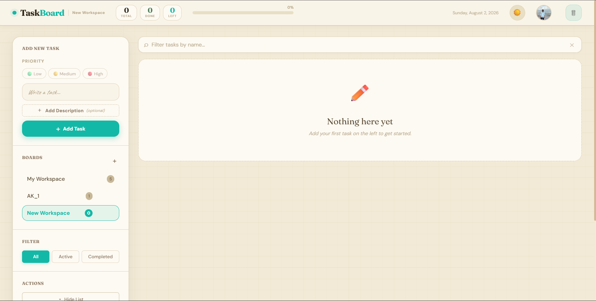

---

### 📋 Task Dashboard

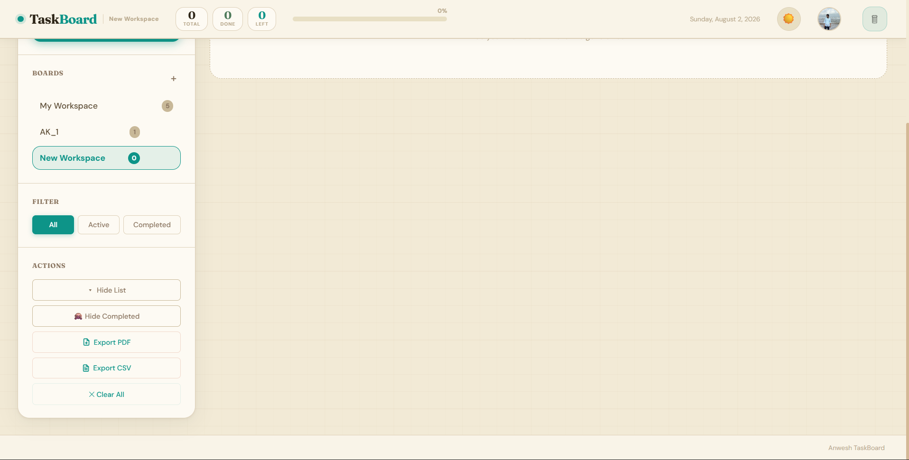

---

### 📊 Task Overview

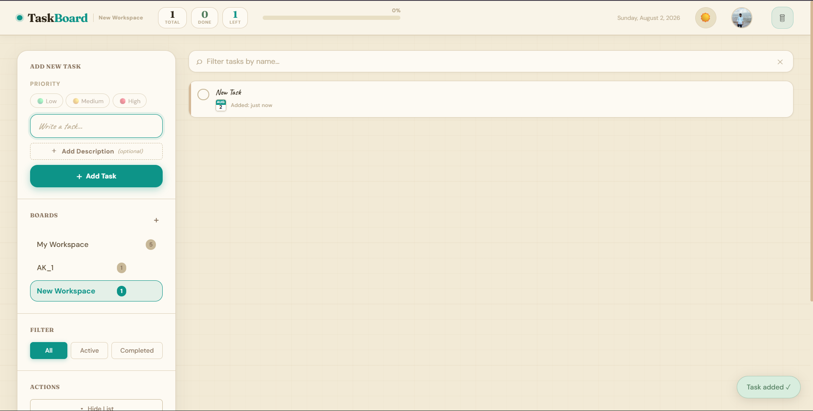

---

### 🔐 Login Page

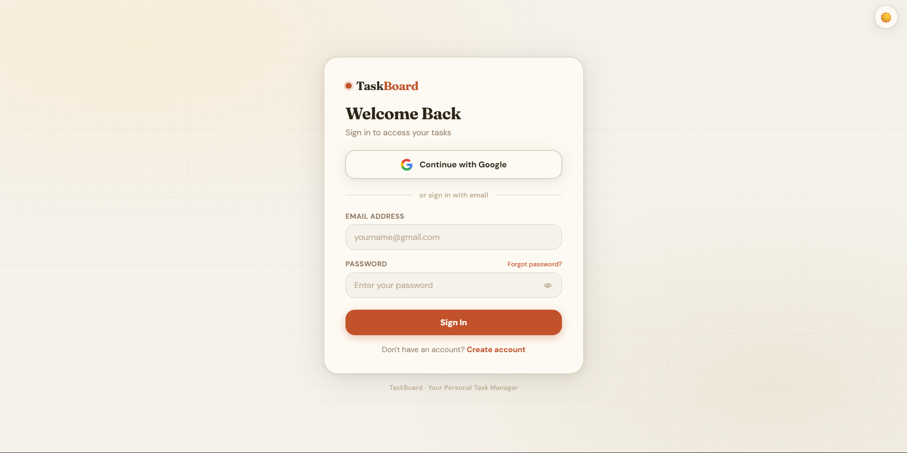

---

### 📝 Create Account

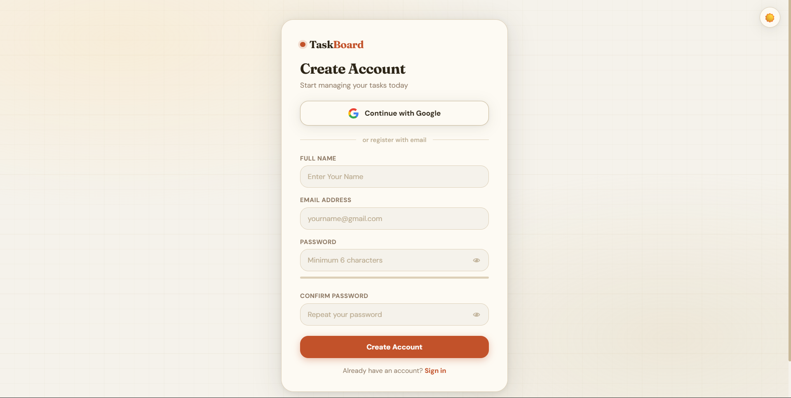

---

### 👤 User Profile

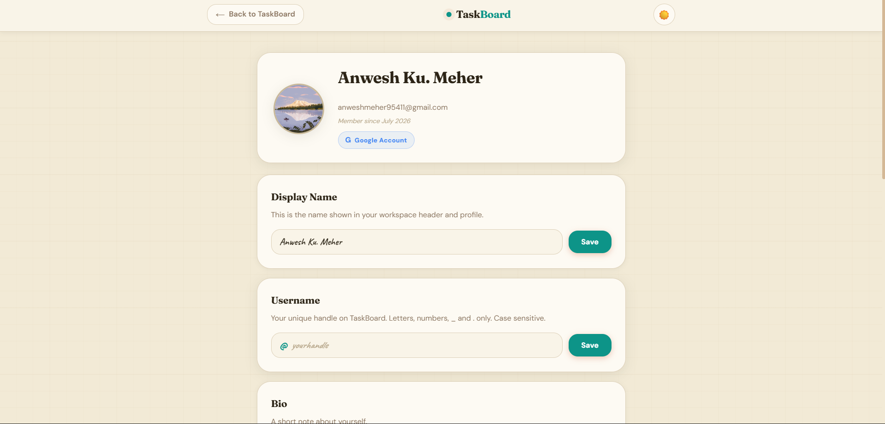

---

### 👤 Edit Profile

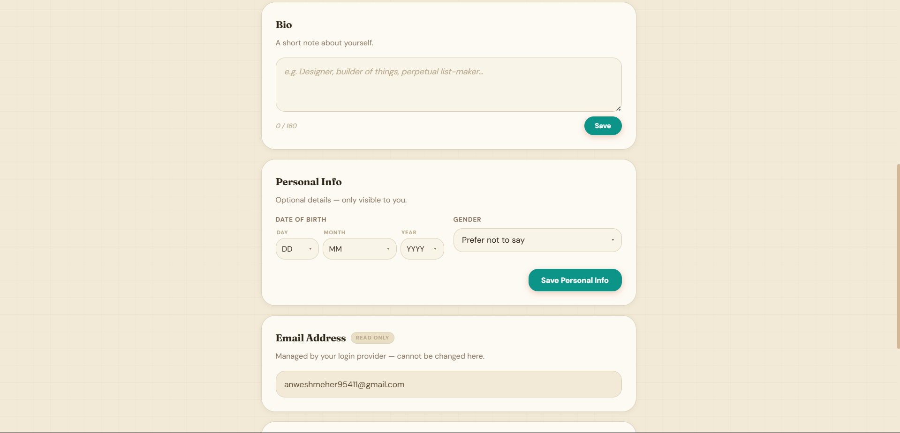

---

### 👤 Profile Settings

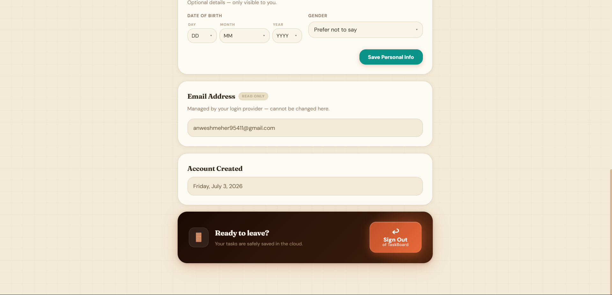

---

### ⚙️ Settings

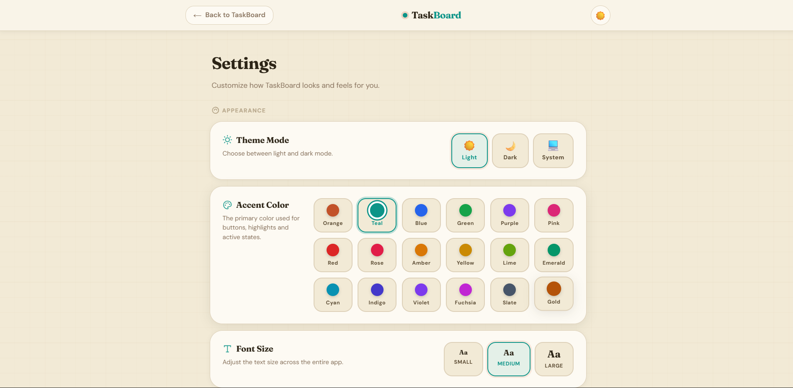

---

### 🎨 Theme Settings

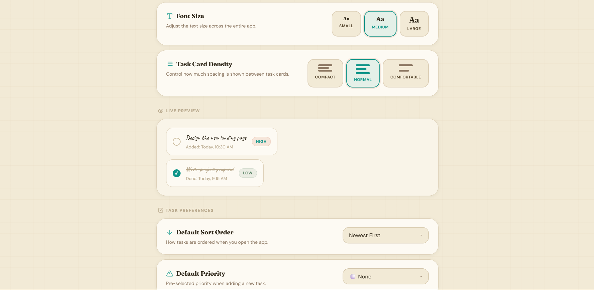

---

### 🎨 Appearance Settings

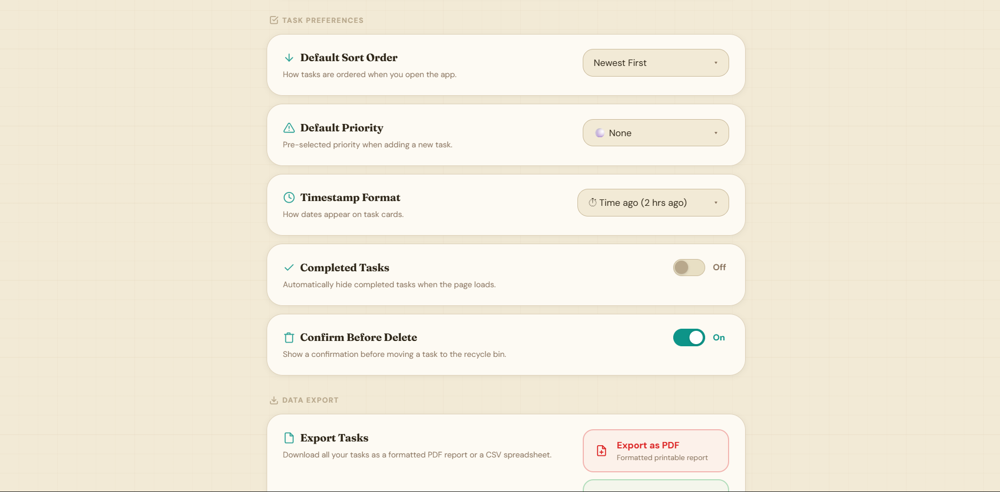

---

### ⚙️ Advanced Settings

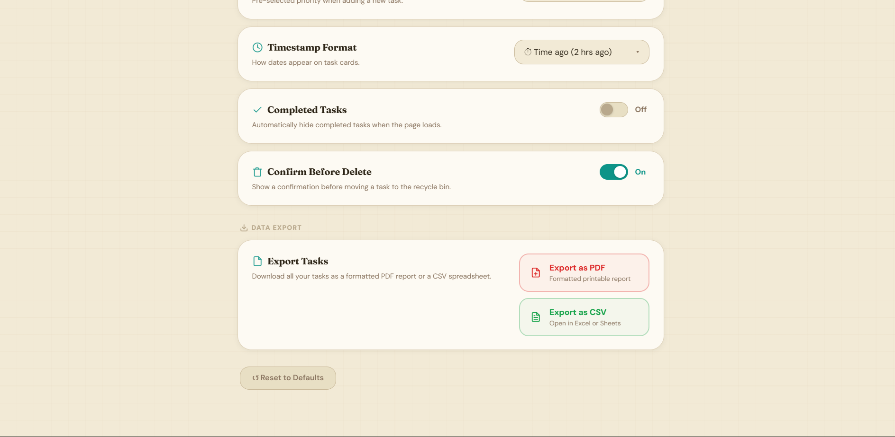

---

### 🌙 Dark Mode

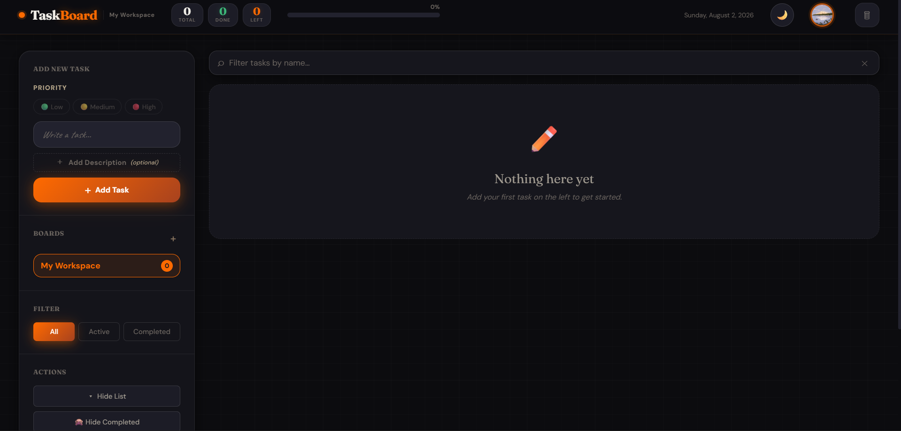

---

### 📱 Mobile Login View

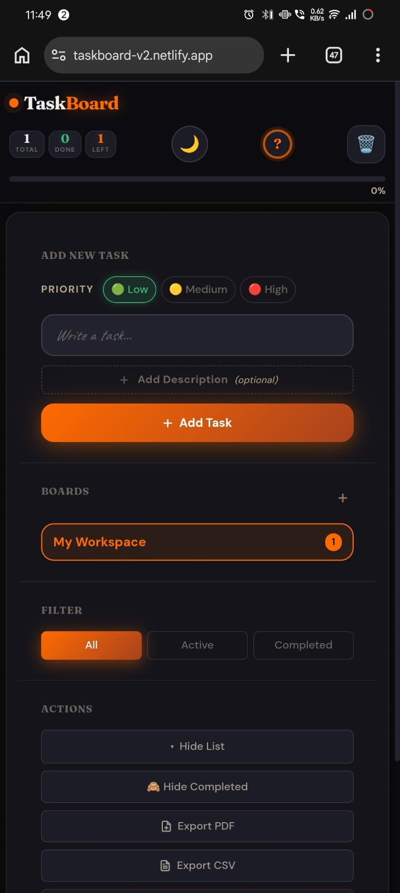

---

### 📱 Mobile Dashboard

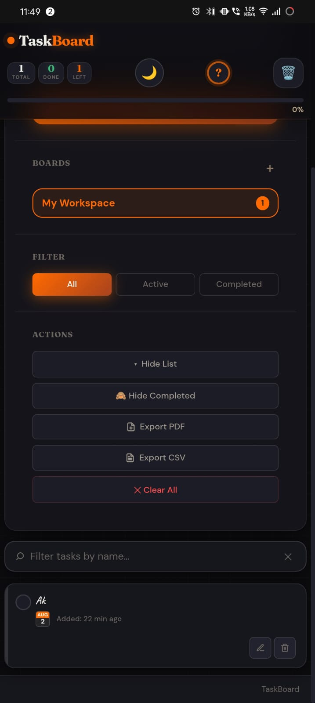## 📂 Project Structure

```text
Task_View/
│
├── assets/
│   └── screenshots/
│       ├── home.png
│       ├── home1.png
│       ├── home2.png
│       ├── login.png
│       ├── register.png
│       ├── profile.png
│       ├── profile1.png
│       ├── profile2.png
│       ├── settings.png
│       ├── settings1.png
│       ├── settings2.png
│       ├── settings3.png
│       ├── dark-mode.png
│       ├── mobile-view.jpeg
│       └── mobile-view1.jpeg
│
├── index.html
├── login.html
├── register.html
├── profile.html
├── settings.html
├── recover.html
├── finddata.html
│
├── style.css
├── auth.css
├── profile.css
├── settings.css
│
├── script.js
├── auth.js
├── profile.js
├── settings.js
├── firebase.js
├── firestore-sync.js
├── service-worker.js
│
├── manifest.json
├── favicon.ico
├── icon-192.png
├── icon-512.png
├── FIRESTORE_RULES.txt
├── .gitignore
├── netlify.toml
└── README.md
```
## ⚙️ Installation & Setup

### 1️⃣ Clone the Repository

```bash
git clone https://github.com/iamakmeher/TaskBoard-V2.git
```

### 2️⃣ Navigate to the Project Directory

```bash
cd TaskBoard-V2
```

### 3️⃣ Open the Project

Open the project in **Visual Studio Code** or any modern code editor.

### 4️⃣ Configure Firebase

- Create a Firebase project.
- Enable **Firebase Authentication**.
- Enable **Cloud Firestore Database**.
- Enable **Firebase Storage**.
- Replace the Firebase configuration inside `firebase.js` with your own Firebase project credentials.

### 5️⃣ Run the Application

Since this is a frontend web application, open `index.html` using **Live Server** in Visual Studio Code.

The application will be available at:

```text
http://127.0.0.1:5500
```

or

```text
http://localhost:5500
```

depending on your Live Server configuration.
## 🔥 Firebase Configuration

This project uses **Firebase** as the backend service for authentication, database management, and cloud storage.

### Firebase Services Used

- 🔐 Firebase Authentication
- ☁️ Cloud Firestore
- 🗂️ Firebase Storage

### Setup Steps

1. Create a new project in the **Firebase Console**.
2. Enable **Authentication** (Email/Password and Google Sign-In).
3. Create a **Cloud Firestore Database**.
4. Enable **Firebase Storage**.
5. Copy your Firebase configuration.
6. Replace the configuration inside **firebase.js** with your own Firebase credentials.
7. Publish the Firestore Security Rules before running the application.

> **Note:** Firebase configuration values are project-specific. Create your own Firebase project instead of using another project's credentials.
## 🤝 Contributing
Contributions are welcome!

If you'd like to improve TaskView, feel free to:

    1. Fork this repository.
    2. Create a new feature branch.
    3. Commit your changes.
    4. Push your branch.
    5. Open a Pull Request.

Please ensure your code follows the existing project structure and coding style.
## ⭐ Show Your Support
If you found this project helpful or interesting:

⭐ Star this repository

🍴 Fork the repository

📢 Share it with others

Your support helps improve the project and motivates future development.
## 🙏 Acknowledgements
Special thanks to the following technologies and platforms that made this project possible:

- Firebase
- Netlify
- jQuery
- HTML5
- CSS3
- JavaScript
- Visual Studio Code
- GitHub
##  📊 Project Information
| Property | Value |
|----------|-------|
| Project Name | TaskView |
| Repository | TaskBoard-V2 |
| Version | 2.0 |
| Status | Active Development |
| Platform | Web |
| Type | Progressive Web Application |
| License | MIT |